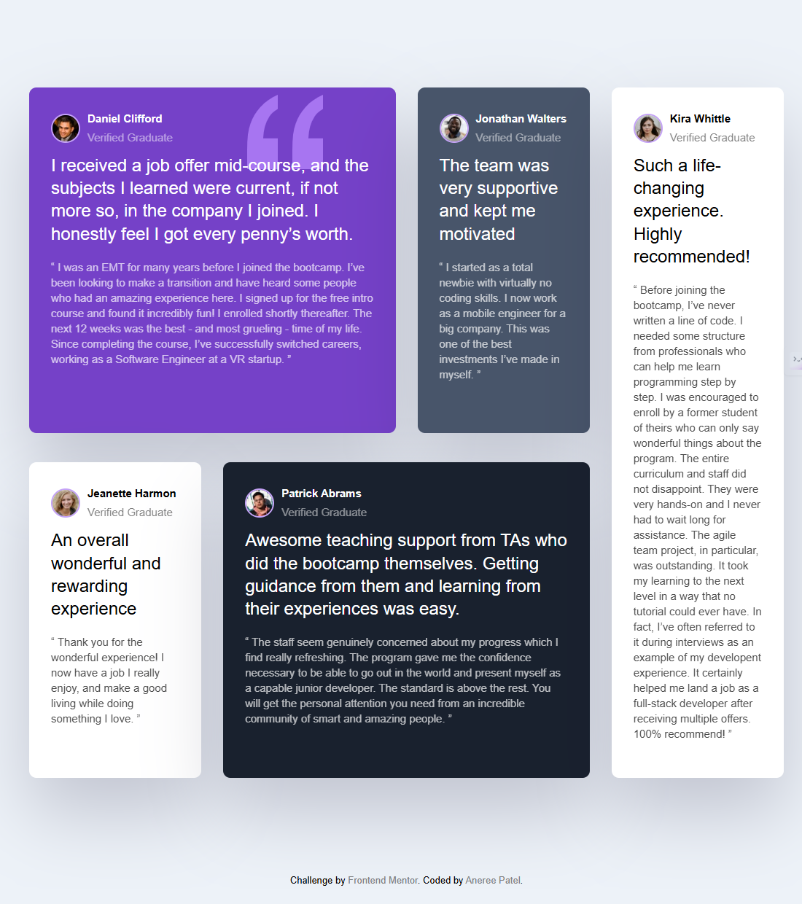

# testimonials-grid-section

## Table of Contents
- [Overview](#overview)
- [The challenge](#the-challenge)
- [Screenshot](#screenshot)
- [Links](#links)
- [My process](#my-process)
- [Built with](#built-with)
- [What I learned](#what-i-learned)
- [Continued development](#continued-development)
- [Credits](#credits)

## Overview

This project is a responsive Testimonials Grid Section built as part of a Frontend Mentor challenge.  
It showcases a clean layout of testimonials with user images, names, and feedback, styled primarily with CSS Grid and Flexbox.

## The challenge

The challenge was to build out this testimonials section to match the provided design and ensure it is fully responsive across different screen sizes.

## Screenshot

## Links

- Solution URL: [My GitHub Repo](https://github.com/Aneree05/testimonials-grid-section)

## My process

- Started by structuring HTML semantic elements for the testimonials.  
- Built the desktop layout first using CSS Grid and Flexbox for alignment within testimonial cards.  
- Then added media queries to create a responsive mobile-first design.  
- Paid attention to typography and spacing to closely match the design.

## Built with

- HTML5  
- CSS3 (CSS Grid, Flexbox)

## What I learned

- How to combine CSS Grid and Flexbox effectively for complex layouts.  
- Responsive design principles and media queries.  
- Organizing project files for clean structure.

## Continued development

- Optimize images to improve page load speed.  
- Add simple hover effects to buttons or testimonial cards for better user interaction.  
- Clean up CSS by organizing styles into smaller, reusable classes.  
- Write brief comments in the code to improve readability for future reference.

## Credits
  
- Frontend Mentor for the [challenge design and assets](https://www.frontendmentor.io/challenges/testimonials-grid-section-Nnw6J7Un7).

- Huge thanks to [Traversy Media](https://www.youtube.com/@TraversyMedia) for introducing me to Frontend Mentor and providing excellent tutorials that helped me complete this project.

